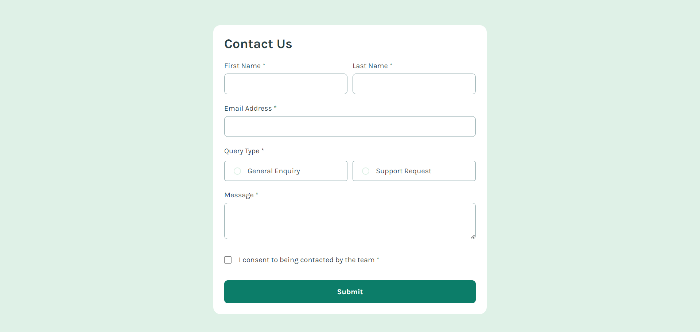
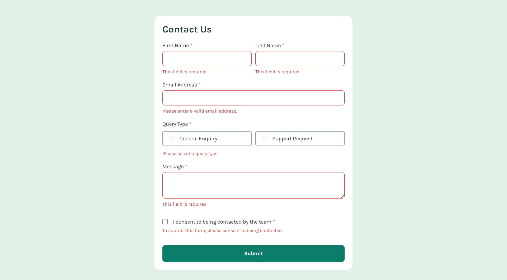
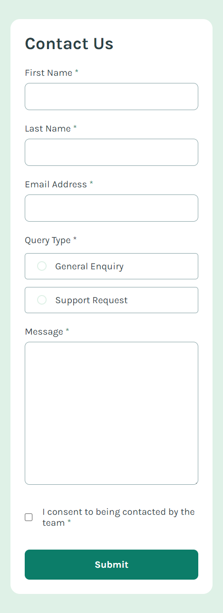

# Frontend Mentor - Contact form solution

This is a solution to the [Contact form challenge on Frontend Mentor](https://www.frontendmentor.io/challenges/contact-form--G-hYlqKJj). Frontend Mentor challenges help you improve your coding skills by building realistic projects. 

## Table of contents

- [Overview](#overview)
  - [The challenge](#the-challenge)
  - [Screenshot](#screenshot)
  - [Links](#links)
- [My process](#my-process)
  - [Built with](#built-with)
  - [What I learned](#what-i-learned)
  - [Continued development](#continued-development)
  - [Useful resources](#useful-resources)
- [Author](#author)

## Overview

### The challenge

Users should be able to:

- Complete the form and see a success toast message upon successful submission
- Receive form validation messages if:
  - A required field has been missed
  - The email address is not formatted correctly
- Complete the form only using their keyboard
- Have inputs, error messages, and the success message announced on their screen reader
- View the optimal layout for the interface depending on their device's screen size
- See hover and focus states for all interactive elements on the page

### Screenshot

### Links

- Solution URL: [Link](https://github.com/codebyveronica/contact-form)
- Live Site URL: [Link](https://codebyveronica.github.io/contact-form/)

## My process

### Built with

- Semantic HTML5 markup
- CSS custom properties
- Flexbox
- CSS Grid
- Mobile-first workflow
- JavaScript

### What I learned

I learned how to validate the email format with RegEx. With this project, I also practiced creating forms and validating them.

### Continued development

I want to continue practicing creating and validating forms, because I believe it is the basis. And I will also continue practicing HTML and CSS to improve my skills more and more, and also continue learning and practicing Java Script.

### Useful resources

- [Stack Overflow](https://stackoverflow.com) - It's a wonderful site for answering a wide range of questions, and you'll always find someone who has had the same question as you with great answers and resolutions helping you understand the problem.

## Author

- Frontend Mentor - [@codebyveronica](https://www.frontendmentor.io/profile/codebyveronica)

